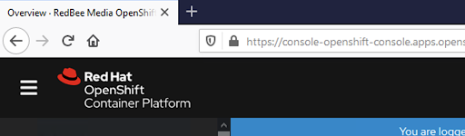
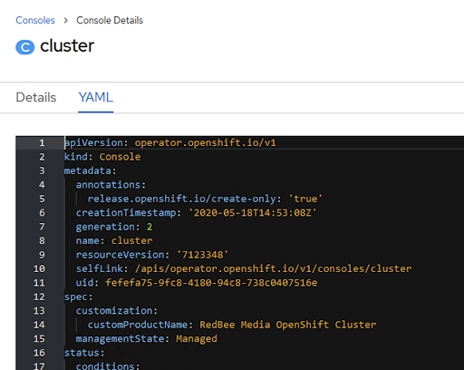

# Global Configuration

The Global Configuration role configures a mix of Openshift configuratons

## Table of Contents
1. [Role Structure](#paragraph9)
2. [Expose Image Registry and Set storage](#paragraph0)
3. [Customise Image Pruner](#paragraph1)
4. [Change Registry URL](#paragraph2)
5. [Disable Self-Provisioner](#paragraph3)
6. [Render Default Project Template](#paragraph4)
7. [Create Default Project Template](#paragraph5)
8. [Patch Global Project configs](#paragraph6)
9. [Set Custom Console Banner name](#paragraph7)
10. [Make Sure Proxy Settings are in-place](#paragraph8)

**Prometheus and Alertmanager storage**: 

:exclamation: This role has a task *Assign Persistent Volumes to Prometheus and Alertmanager* to add Persistent Storage to Prometheus and Alertmanager Pods so that Monitoring historic data is persistent, however, we cannot implement it because NFS is being used in the PoC as the Persistent Storage solution. Non POSIX compliant filesystems are not supported by Prometheus's local storage, corruptions may happen, without possibility to recover. NFS is only potentially POSIX, most implementations are not. → https://prometheus.io/docs/prometheus/latest/storage/


## Role Structure <a name="paragraph9"></a>

```
├── global-config
│   ├── defaults
│   │   └── main.yml
│   ├── files
│   │   └── main.yml
│   ├── images
│   │   ├── banner-example.png
│   │   └── yaml-banner-example.png
│   ├── README.md
│   ├── tasks
│   │   └── main.yml
│   ├── templates
│   │   └── project-request.yaml.j2
│   └── vars
│       └── main.yml
```

## Expose Image Registry and set storage <a name="paragraph0"></a>

```yaml
- name: Expose Image Registry and set storage
  k8s:
    api_version: imageregistry.operator.openshift.io/v1
    state: present
    merge_type: 
      - strategic-merge
      - merge
    kind: Config
    name: cluster
    definition:
      spec:
        defaultRoute: true                 #1
        replicas: 2                        #2
        managementState: Managed           #3
        storage:
          pvc:
            claim: image-registry-storage  #4
```

1. Determines whether or not an external route is defined using the default hostname. If enabled, the route uses re-encrypt encryption. Defaults to false.
2. Replica count for the registry.
3. **Managed:** The Operator updates the registry as configuration resources are updated.
4. Details for configuring registry storage. In this case we are claiming the `image-registry-storage` persistent volume created in the `storage` role.


## Customise Image Pruner <a name="paragraph1"></a>

Over time, API objects created in OpenShift Container Platform can accumulate in the cluster’s etcd data store through normal user operations, such as when building and deploying applications.

Cluster administrators can periodically prune older versions of objects from the cluster that are no longer required. For example, by pruning images you can delete older images and layers that are no longer in use, but are still taking up disk space.

Images that are no longer required by the system due to age, status, or exceed limits are automatically pruned. Cluster administrators can configure the Pruning Custom Resource, or delete it to disable it.

```yaml
- name: Customise Image Pruner
  k8s:
    api_version: imageregistry.operator.openshift.io/v1
    state: present
    merge_type: 
      - strategic-merge
      - merge
    kind: ImagePruner
    name: cluster
    definition:
      spec:
        failedJobsHistoryLimit: 3          #1
        keepTagRevisions: 5                #2
        schedule: 15 01 * * 6              #3
        successfulJobsHistoryLimit: 3      #4
        suspend: false                     #5
```

1. The maximum number of failed jobs to retain. Must be >= 1 to ensure metrics are reported. Defaults to 3 if not set.
2. The number of revisions per tag to keep. This is an optional field, and it defaults to 3 if not set.
3. `CronJob` formatted schedule, defaults to daily at midnight for new clusters. This is a required field.
4. The maximum number of successful jobs to retain. Must be >= 1 to ensure metrics are reported. Defaults to 3 if not set.
5.  If set to true, the CronJob running pruning is suspended. This is an optional field, and it defaults to false.

## Change Registry URL <a name="paragraph2"></a>

```yaml
- name: Change Registry URL
  k8s:
    state: present
    merge_type: 
      - strategic-merge
      - merge
    name: default-route
    kind: Route
    namespace: openshift-image-registry
    definition:
      spec:
        host: "{{ image_registry_url }}"     #1
```
1. Changes the image registry URL to the one specified in `group_vars/all`

## Disable Self-Provisioner <a name="paragraph3"></a>

```yaml
- name: Disable Self-Provisioner
  k8s:
    api_version: rbac.authorization.k8s.io/v1
    kind: ClusterRoleBinding
    merge_type: 
      - strategic-merge
      - merge        
    state: present
    name: self-provisioners
    definition:
      metadata:
        annotations:
          rbac.authorization.kubernetes.io/autoupdate: "false"  #1
      subjects: null                                            #2
```
1. Sets the self provisioner autoupdate to false
2. Unbinds the CRB from its subject of `system:authenticated:oauth`

## Render Default Project Template <a name="paragraph4"></a>

### Template Deep Dive

The template `./templates/project-request.yaml.j2` is explained below 
```yaml
apiVersion: template.openshift.io/v1                         #1
kind: Template
metadata:
  creationTimestamp: null
  name: project-request
objects:
- apiVersion: networking.k8s.io/v1                           #2
  kind: NetworkPolicy
  metadata:
    name: allow-from-self
  spec:
    podSelector: {}
    ingress:
    - from:
        - podSelector: {}
    policyTypes:
    - Ingress
- apiVersion: networking.k8s.io/v1                           #3
  kind: NetworkPolicy
  metadata:
    name: allow-from-openshift-logging
  spec:
    ingress:
    - from:
      - namespaceSelector:
          matchLabels:
            network.openshift.io/policy-group: logging
    podSelector: {}
    policyTypes:
    - Ingress
- apiVersion: networking.k8s.io/v1                           #4
  kind: NetworkPolicy
  metadata:
    name: allow-from-openshift-monitoring
  spec:
    ingress:
    - from:
      - namespaceSelector:
          matchLabels:
            network.openshift.io/policy-group: monitoring
    podSelector: {}
    policyTypes:
    - Ingress
- apiVersion: networking.k8s.io/v1                           #5
  kind: NetworkPolicy
  metadata:
  name: allow-from-openshift-ingress
  spec:
    ingress:
    - from:
      - namespaceSelector:
          matchLabels:
            network.openshift.io/policy-group: ingress
    podSelector: {}
    policyTypes:
    - Ingress
- apiVersion: v1                                             #6
  kind: LimitRange
  metadata:
    name: "openshift-limit-ranges"
  spec:
    limits:
      - type: Container
        default:
          cpu: 100m
          memory: 200Mi
        defaultRequest:
          cpu: 50m
          memory: 100Mi
- apiVersion: v1                                             #7
  kind: ResourceQuota
  metadata:
    name: "openshift-resource-quota"
  spec:
    hard:
      requests.cpu: '{{ requests_cpu }}'
      requests.memory: '{{ requests_memory }}' 
      limits.cpu: '{{ limits_cpu }}'
      limits.memory: '{{ limits_memory }}'
      persistentvolumeclaims: '{{ persistentvolumeclaims }}'
- apiVersion: project.openshift.io/v1                        #8
  kind: Project
  metadata:
    annotations:
      openshift.io/description: ${PROJECT_DESCRIPTION}
      openshift.io/display-name: ${PROJECT_DISPLAYNAME}
      openshift.io/requester: ${PROJECT_REQUESTING_USER}
    creationTimestamp: null
    name: ${PROJECT_NAME}
  spec: {}
  status: {}
- apiVersion: rbac.authorization.k8s.io/v1                   #9
  kind: RoleBinding
  metadata:
    creationTimestamp: null
    name: admin
    namespace: ${PROJECT_NAME}
  roleRef:
    apiGroup: rbac.authorization.k8s.io
    kind: ClusterRole
    name: admin
  subjects:
  - apiGroup: rbac.authorization.k8s.io
    kind: User
    name: ${PROJECT_ADMIN_USER}
parameters:
- name: PROJECT_NAME
- name: PROJECT_DISPLAYNAME
- name: PROJECT_DESCRIPTION
- name: PROJECT_ADMIN_USER
- name: PROJECT_REQUESTING_USER

```

1. Templates make it easy to recreate all the objects of your application. The template will define the objects it creates along with some metadata to guide the creation of those objects.
2. Allows pods in the project to access to all pods within its own namespace/project
3. Allows pods in the project access pods in the `openshift-logging` namespace 
4. Allows pods in the project access pods in the `openshift-monitoring` namespace 
5. Allows pods in the project access the namespaces with the label `ingress`. In our deployment the `default` namespace and the `openshift-ingress` namespace have this label. 
6. A resource quota, defined by a ResourceQuota object, provides constraints that limit aggregate resource consumption per namespace. It can limit the quantity of objects that can be created in a namespace by type, as well as the total amount of compute resources that may be consumed by resources in that project.
7. With resource quotas, cluster administrators can restrict resource consumption and creation on a namespace basis. Within a namespace, a Pod or Container can consume as much CPU and memory as defined by the namespace’s resource quota. There is a concern that one Pod or Container could monopolize all available resources. A LimitRange is a policy to constrain resource allocations (to Pods or Containers) in a namespace.
8. A project allows a community of users to organize and manage their content in isolation from other communities. Using the parameters, we can specify a project description, displayname, requesting user and project name to the template. 
9. A Role Binding that binds the admin Role to the project admin user of the namespace. 

### Rendering the Template

```yaml
- name: Render Default Project Template
  template:
    src: templates/project-request.yaml.j2
    dest: "{{ role_path }}/files/project-request.yaml"
```

This builds the template `project-request` template.

## Create Default Project Template <a name="paragraph5"></a>

```yaml
- name: Create Default Project Template
  k8s:
    state: present
    namespace: openshift-config
    src: "{{ role_path }}/files/project-request.yaml"
```

This creates the default project template and applies it to the `openshift-config` namespace.

## Patch Global Project configs <a name="paragraph6"></a>


```yaml
- name: Patch Global Project config
  k8s:
    api_version: config.openshift.io/v1
    state: present
    merge_type: 
      - strategic-merge
      - merge
    name: cluster
    kind: Project
    definition:
      spec:
        projectRequestTemplate:
          name: project-request       #1
```
1. This will set the previously created `projectRequestTemplate` named `project-request` as the default template for newly created projects.

## Set Custom Console Banner name <a name="paragraph7"></a>

```yaml
- name: Set Custom Console Banner name
  k8s:
    api_version: operator.openshift.io/v1
    state: present
    merge_type: 
      - strategic-merge
      - merge
    kind: Console
    name: cluster
    definition:
      spec:
        customization:
          customProductName: RedBee Media OpenShift Cluster     #1
```
1. Sets the console banner name

### Expected Patch Outcome
The console should look similar to this once it's been patched and the pods redeployed:



With the patched `yaml` looking like:



## Make sure proxy setting are in-place <a name="paragraph8"></a>

```yaml
- name: Make sure proxy setting is in-place
  k8s:
    api_version: config.openshift.io/v1
    state: present
    merge_type:
      - strategic-merge
      - merge
    kind: Proxy
    name: cluster
    definition:
      spec:
        httpProxy: '{{ proxy_url }}'    #1
        httpsProxy: '{{ proxy_url }}'   #2
        noProxy: '{{ no_proxy }}'       #3

```

1. Applies the http proxy url specified in `group_vars/all`
2. Applies the https proxy url specified in `group_vars/all`
3. Applies the no proxy url specified in `group_vars/all`
