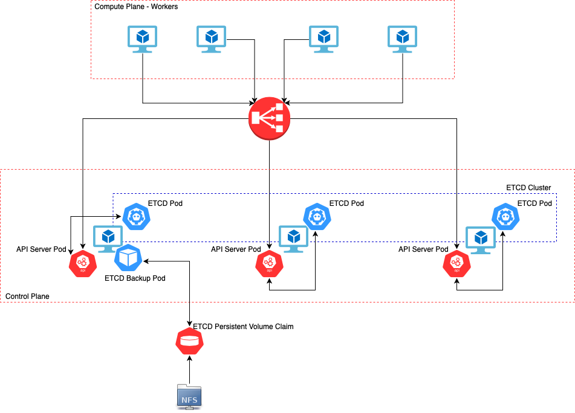
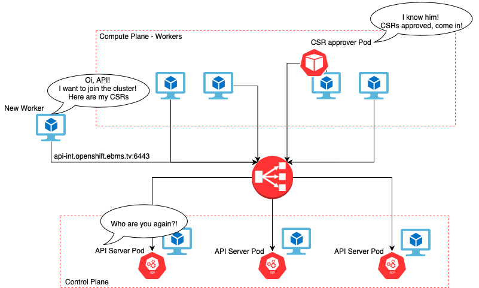

# Ansible Role for ETCD Backups and node CSRs auto-approval CronJobs

## Table of Contents
1. [Role Structure](#paragraph2)
2. [ETCD Backup CronJob Task](#paragraph0)
3. [CSR Auto-Approval CronJob Task](#paragraph1)

## Role Structure <a name="paragraph2"></a>

```
├── cronjobs
│   ├── defaults
│   │   └── main.yml
│   ├── files
│   │   └── main.yml
│   ├── images
│   │   ├── csr-approver.png
│   │   └── etcd-diagram.png
│   ├── README.md
│   ├── tasks
│   │   └── main.yml
│   ├── templates
│   │   ├── csr
│   │   │   ├── csr-approver-cronjob.yaml.j2
│   │   │   └── csr-cmd-configmap.yaml.j2
│   │   └── etcd
│   │       ├── etcd-backup-configmap.yaml.j2
│   │       ├── etcd-backup-cronjob.yaml.j2
│   │       ├── etcd-pvc.yaml.j2
│   │       └── etcd-pv.yaml.j2
│   └── vars
│       └── main.yml

```

## ETCD Backup CronJob Task <a name="paragraph0"></a>



ETCD is the key-value store for OpenShift Container Platform, which persists the state of all resource objects.

Back up your cluster’s etcd data regularly and store in a secure location ideally outside the OpenShift Container Platform environment. Do not take an etcd backup before the first certificate rotation completes, which occurs 24 hours after installation, otherwise the backup will contain expired certificates. It is also recommended to take etcd backups during non-peak usage hours, as it is a blocking action.

Once you have an etcd backup, you can restore to a previous cluster state.

You can perform the etcd data backup process on any master host that has connectivity to the etcd cluster, where the proper certificates are provided. 

In the Diagram above we are scheduling ETCD Backup Pod on Master0.

For more about ETCD Backup and Restore, please refer to [Confluence page](https://tools.cloud.ebms.ericsson.net/confluence/display/VIVRH3PP/ETCD+Backup+and+Restore)

In order to have etcd snapshots daily, we are creating a scheduled pod on OpenShift with privileges to run as root and mounting persistent storage where we are saving the snapshots. Snapshots can be used at a later time if you need to restore etcd.

You should only save a backup from a single master host. You do not need a backup from each master host in the cluster.

Lets walk through the Role Tasks. 

Below we are creating and Granting privileges to Service Account `approver` which will run the Backup Pod.
We give this Service Account `cluster-admin` role and granting permisions to run containers as user `root` via SecurityContextConstraints.

*Setting up Role Based Access Control and Security Context Constraints*:
```yaml
    - name: Create Service Account approver
      k8s:
        state: present
        kind: ServiceAccount
        namespace: openshift-config
        name: approver

    - name: Bind cluster-admin role to the approver Service Account
      k8s:
        state: present
        api_version: rbac.authorization.k8s.io/v1
        kind: ClusterRoleBinding
        name: cluster-admin-approver-sa-crb
        namespace: openshift-config
        definition:
          metadata:
            annotations:
              rbac.authorization.kubernetes.io/autoupdate: "true"  
          roleRef:
            apiGroup: rbac.authorization.k8s.io
            kind: ClusterRole
            name: cluster-admin
          subjects:
          - apiGroup: rbac.authorization.k8s.io
            kind: User
            name: approver

    - name: Get current SCC user state
      k8s_info:
        kind: SecurityContextConstraints
        namespace: openshift-config
        name: privileged
      register: privileged_scc_output

    - name: Add current SCC privileged users to array
      set_fact:
        scc_usernames: "{{ scc_usernames  }} + [ '{{ item }}'  ]"
      with_items: "{{ privileged_scc_output['resources'][0]['users'] }}"

    - name: Append new SCC privileged user to the array
      set_fact:
        scc_username: "{{ scc_usernames  }} + ['system:serviceaccount:openshift-config:approver']"

    - name: Allow Cron Job pods to run as root by applying new SCC
      k8s:
        state: present
        kind: SecurityContextConstraints
        namespace: openshift-config
        merge_type:
          - strategic-merge
          - merge
        name: privileged
        definition:
          users: "{{ scc_usernames }}"
```

* **Bind cluster-admin role to the approver Service Account** - Grant `cluster-admin` role to `approver` Service Account.
* **Get current SCC user state** - Filter the list of Users and Service Accounts having privileged permissions.
* **Add current SCC privileged users to array** - Form the Users Array.
* **Append new SCC privileged user to the array** - Add `approver` Service Account to the Array of Users with privileged permissions.
* **Allow Cron Job pods to run as root by applying new SCC** - Patch SecurityContextConstraints privileged object providing new list of users with privileged permissions.


Below is a code snippet with some of the tasks where we are rendering and creating Persistent Volume with Persistent Volume Claim which will be used by ETCD Backup Pod, ETCD Backup CronJob (think about it as scheduled Deployment) and ConfigMap (we save our ETCD Backup shell scripts which will run the Backup here) objects. 

:exclamation: PersistentVolume manifest is explicitly configured to use NFS storage. If other kind of storage with `ReadWriteMany` access mode is used, `etcd-pv.yaml.j2` template will have to be updated accordingly. More about [Persistent Volumes](https://tools.cloud.ebms.ericsson.net/confluence/display/VIVRH3PP/Storage)

*Setting up ETCD Backup CronJob, PersistentVolume, PersistentVolumeClaim and ConfigMap*:
```yaml
---
    - name: Render the ETCD Backup ConfigMap template
      template:
        src: templates/etcd/etcd-backup-configmap.yaml.j2 
        dest: "{{ role_path }}/files/etcd-backup-configmap.yaml"
        mode: '0600'

    - name: Render PV template
      template:
        src: templates/etcd/etcd-pv.yaml.j2
        dest: "{{ role_path }}/files/etcd-pv.yaml"
        mode: '0600'
<...>

    - name: Create ETCD Backup ConfigMap
      k8s:
        state: present
        src: "{{ role_path }}/files/etcd-backup-configmap.yaml"

    - name: Create ETCD PV
      k8s:
        state: present
        src: "{{ role_path }}/files/etcd-pv.yaml"
<...>
```

Lets look at the ETCD Backups CronJob object:

```yaml
kind: CronJob
apiVersion: batch/v1beta1
metadata:
  name: cronjob-etcd-backup                                             
  namespace: openshift-config
  labels:
    purpose: etcd-backup
spec:
  schedule: {{ etcd_backup_cron_schedule }}                                  #1
  startingDeadlineSeconds: 200
  concurrencyPolicy: Forbid                                                  #2
  suspend: false
  jobTemplate:
    spec:
      backoffLimit: 0
      template:
        spec:
          nodeSelector:                                                      #3
            node-role.kubernetes.io/master: ''
          restartPolicy: Never
          activeDeadlineSeconds: 200
          serviceAccountName: approver                                       
          hostNetwork: true
          containers:
            - resources:
                requests:
                  cpu: 300m
                  memory: 250Mi
              terminationMessagePath: /dev/termination-log
              name: etcd-backup
              command:                                                       #4
                - /bin/sh
                - '-c'
                - >-
                  /usr/local/bin/etcd-backup.sh && ls -1 /etcd-backup/* | sort -r | tail -n +6 | xargs rm -rf > /dev/null 2>&1
              env:                                                           #5
                - name: HTTP_PROXY                                           
                  value: {{ proxy_url }}
                - name: HTTPS_PROXY
                  value: {{ proxy_url }}
                - name: NO_PROXY
                  value: >-
                    {{ no_proxy }}
              securityContext:                                               #6
                privileged: true
              imagePullPolicy: IfNotPresent
              volumeMounts:                                                  #7
                - name: certs
                  mountPath: /etc/ssl/etcd/
                - name: conf
                  mountPath: /etc/etcd/
                - name: kubeconfig
                  mountPath: /etc/kubernetes/
                - name: etcd-backup-script
                  mountPath: /usr/local/bin/etcd-backup.sh
                  subPath: etcd-backup.sh
                - name: etcd-backup-script
                  mountPath: /usr/local/bin/etcd-snapshot-backup-disconnected.sh
                  subPath: etcd-snapshot-backup-disconnected.sh
                - name: etcd-backup
                  mountPath: /etcd-backup
                - name: scripts
                  mountPath: /usr/local/bin
              terminationMessagePolicy: FallbackToLogsOnError
              image: >-                                                      #8
                quay.io/openshift-release-dev/ocp-v4.0-art-dev@sha256:6a2378154881e6f9a4638f41242518d850e19b0d7d9ef74a2be55b87f4625e87
          serviceAccount: approver                                           #9
          tolerations:                                                       #10
            - operator: Exists
              effect: NoSchedule
            - operator: Exists
              effect: NoExecute            
          volumes:                                                           #11
            - name: certs
              hostPath:
                path: /etc/kubernetes/static-pod-resources/etcd-member
                type: ''
            - name: conf
              hostPath:
                path: /etc/etcd
                type: ''
            - name: kubeconfig
              hostPath:
                path: /etc/kubernetes
                type: ''
            - name: scripts
              hostPath:
                path: /usr/local/bin
                type: ''
            - name: etcd-backup
              persistentVolumeClaim:
                claimName: etcd-backup
            - name: etcd-backup-script
              configMap:
                name: etcd-backup-script
                defaultMode: 493
```

1. Crontab like schedule -> https://crontab.guru 
2. If concurrencyPolicy is set to Forbid and a CronJob was attempted to be scheduled when there was a previous schedule still running, then it would count as missed. We do not want to run two etcd backups at the same time. Especially if current one is failing.
3. We are setting nodeSelector to schedule the pod only on the node with the label `node-role.kubernetes.io/master: ''`
4. in the `command` section we are providing the shell command which will be executed by the pod. In this case, we are running the etcd backup and keeping last 6 backup snapshots.
5. We are using HTTP Proxy so we are setting environment variables with HTTP Proxy values
6. We are setting securityContext to `privileged: true` allowing the pod user to run as `root`.
7. We are mounting etcd configs and certificates from the Master host to the container keeping the same mount points pretending we are running etcd backup command directly on the Master host.
8. We are using etcd container image because it contains all required tools like `etcdctl`
9. We are setting the service account to be `approver` which has privileges to run containers as `root` user.
10. Since Master hosts have taints (required so that Schedule wouldn't schedule application pods on them) we need to tolerate those taints.
11. We are mounting directories (hostPath) from the Master host onto container. 


## CSR Auto-Approval CronJob Task <a name="paragraph1"></a>



Here we are rendering and creating CSR approver CronJob (think about it as scheduled Deployment) and ConfigMap (we save our CSR approver shell scripts which will run the `oc adm certificate approve <csr-name>` command) objects. 

*Setting up CSR approver CronJob and ConfigMap*:
```yaml
    - name: Render the CSR approver CronJob template
      template:
        src: templates/csr/csr-approver-cronjob.yaml.j2
        dest: "{{ role_path }}/files/csr-approver-cronjob.yaml"
        mode: '0600'
<...>

    - name: Create CSR approver ConfigMap
      ignore_errors: true
      k8s:
        state: present
        src: "{{ role_path }}/files/csr-cmd-configmap.yaml"
<...>
```

Let look at CSR approver CronJob object:

```yaml
kind: CronJob
apiVersion: batch/v1beta1
metadata:
  name: csr-approver
  namespace: openshift-config
  labels:
    run: csr-approver
spec:
  schedule: {{ node_csr_cron_schedule }}                                 #1
  concurrencyPolicy: Replace                                             #2
  suspend: false
  jobTemplate:
    metadata:
      creationTimestamp: null
    spec:
      template:
        metadata:
          creationTimestamp: null
          labels:
            run: csr-approver
        spec:
          restartPolicy: OnFailure
          serviceAccountName: approver                                   
          containers:
            - name: approver
              image: registry.redhat.io/openshift4/ose-cli               #3
              command:                                                   #4
                - /bin/sh
                - '-c'
                - /csr/cmd.sh
              resources: {}
              volumeMounts:                                              #4
                - name: config
                  mountPath: /csr
              terminationMessagePath: /dev/termination-log
              terminationMessagePolicy: File
              imagePullPolicy: Always
          serviceAccount: approver                                       #5
          volumes:                                                       #4
            - name: config
              configMap:
                name: csr-cmd
                defaultMode: 347
```

1. Crontab like schedule -> https://crontab.guru 
2. If the current/previous job failed, we will terminate the current one and spin up the new one.
3. We are using the container image which contains `oc` CLI tool since its required when approving CSRs.
4. We run a shell script which is mounted as a ConfigMap to `/csr/` directory on the pod.
5. We are setting the service account to be `approver` which has `cluster-admin` privileges.
