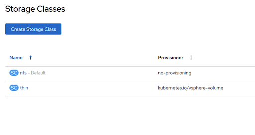
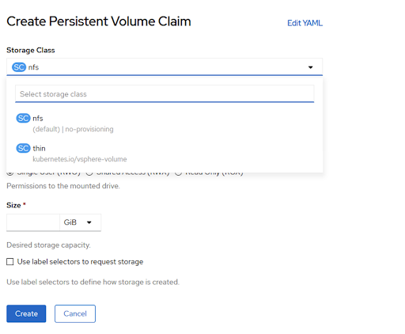

# Storage Role #

## Table of Contents
1. [What This Role Does](#paragraph0)
2. [Storage Role Structure](#paragraph1)
3. [main.yml Deep Dive](#paragraph2)
4. [Creating the `nfs` StorageClass](#paragraph3)
5. [Switching the `thin` storageClass to non-default](#paragraph4)
6. [Openshift PVs and PVCs](#paragraph5)
7. [Building the PV and PVC image repository templates into manifests](#paragraph6)
8. [Creating the PV and PVC manifests for the Image Registry](#paragraph7)

## What This Role Does <a name="paragraph0"></a>
* Creates the `nfs` StorageClass
* Assigns the `nfs` StorageClass as default
* Switches the current `thin` StorageClass to non-default
* Builds the image registry PV and PVC manifests from templates
* Creates the image repository PV and PVC from the built manifests 

## Storage Role Structure <a name="paragraph1"></a>

```
    └── storage
        ├── defaults
        │   └── main.yml
        ├── README.md
        ├── tasks
        │   └── main.yml
        ├── templates
        │   ├── image-registry-pvc.yaml.j2
        │   └── image-registry-pv.yaml.j2
        └── vars
            └── main.yml
```
The `main.yml` in our tasks folder contains the role functionality, whereas the `templates` folder contains our pvc and pv templates for the image registry.

## main.yml Deep Dive <a name="paragraph2"></a>

### Creating the `nfs` StorageClass <a name="paragraph3"></a>

The `Create Primary Storage Class` task creates the Primary StorageClass. Our Primary StorageClass will be called `nfs`

```yaml
    - name: Create nfs Storage Class
      k8s:
        state: present
        kind: StorageClass
        api_version: storage.k8s.io/v1
        name: '{{ storage_class }}'
        definition:
          metadata:
            annotations:
              storageclass.kubernetes.io/is-default-class: 'true'   #1
          provisioner: no-provisioning                              #2 
          reclaimPolicy: Delete                                     #3
          volumeBindingMode: Immediate                              #4
```

1. **`storageclass.kubernetes.io/is-default-class`**
We set the `nfs` StorageClass to be the deafult one by setting the annotation `storageclass.kubernetes.io/is-default-class` to `true`. 

2. **`provisioner`**
We set provisioner to `no-provisioning` because there is no dynamic provisioning feature for nfs in kubernetes. Since the provisioner key is mandatory, we tell Openshift not to provision any volumes for us automatically.

3. **`VolumeBindingMode`**
`volumeBindingMode` indicates how Persistent Volume Claims should be provisioned and bound. When unset, VolumeBinding Immediate is used. This field is only honored by servers that enable the VolumeScheduling feature.

4. **`reclaimPolicy`**
PersistentVolumes that are dynamically created by a StorageClass will have the reclaim policy specified in the reclaimPolicy field of the class, which can be either Delete or Retain. If no reclaimPolicy is specified when a StorageClass object is created, it will default to Delete. PersistentVolumes that are created manually and managed via a StorageClass will have whatever reclaim policy they were assigned at creation.

### Switching the `thin` storageClass to non-default <a name="paragraph4"></a>

The `thin` storageclass is created during the installation of Openshift when the cloud-provider is vSphere. It can be used for provisioning VMDK disks as persistent volumes. Since we are not using VMDKs and we do not have underlying shared datastore (which would be available for both availability zones/datacenters), the `thin` StorageClass is not relevant to us. As this StorageClass is maintianed by an Operator we cannot remove it, we can however switch the **`storageclass.kubernetes.io/is-default-class`** key to `false`. This ensures that the previously created `nfs` StorageClass will have precedence when creating new PVCs.

```yaml
    - name: Switch thin storage class to non-deafult
      k8s:
        state: present
        kind: StorageClass
        api_version: storage.k8s.io/v1
        merge_type:
          - strategic-merge
          - merge
        name: thin
        definition:
          metadata:
            annotations:
              storageclass.kubernetes.io/is-default-class: 'false'
```

After applying these 2 tasks we should see that nfs has been set to `default` when observing the Storage Classes.



We should also see nfs as our deafult Storage Class when creating PVCs.



## Openshift PVs and PVCs <a name="paragraph5"></a>

OpenShift Container Platform uses the Kubernetes persistent volume (PV) framework to allow cluster administrators to provision persistent storage for a cluster. Developers can use persistent volume claims (PVCs) to request PV resources without having specific knowledge of the underlying storage infrastructure.

PVCs are specific to a project, and are created and used by developers as a means to use a PV. PV resources on their own are not scoped to any single project; they can be shared across the entire OpenShift Container Platform cluster and claimed from any project. After a PV is bound to a PVC, that PV can not then be bound to additional PVCs. This has the effect of scoping a bound PV to a single namespace, that of the binding project.

### Building the PV and PVC image repository templates into manifests <a name="paragraph6"></a>

The PV template takes the parameters `image_registry_pv_size`, `nfs_server`, `image_registry_nfs_server_share_path` and `image_registry_storageclass_name`. These parameters can be set in the `groups_vars/all` file.

:exclamation: PersistentVolume manifest is explicitly configured to use NFS storage. If other kind of storage with `ReadWriteMany` access mode is used, `image-registry-pv.yaml.j2` template will have to be updated accordingly. More about [Persistent Volumes](https://tools.cloud.ebms.ericsson.net/confluence/display/VIVRH3PP/Storage)

```yaml
kind: PersistentVolume
apiVersion: v1
metadata:
  name: image-registry-storage
spec:
  capacity:
    storage: {{ image_registry_pv_size }}
  nfs:
    server: {{ nfs_server }}
    path: {{ image_registry_nfs_server_share_path }}
  accessModes:
    - ReadWriteMany
  persistentVolumeReclaimPolicy: Retain
  storageClassName: {{ image_registry_storageclass_name }}
  volumeMode: Filesystem

```

The PVC template takes the parameters `image_registry_pv_size` and `image_registry_storageclass_name`. These parameters can be set in the `groups_vars/all` file.

This PVC will submit a claim for storage from the PV `image-registry-storage`.

```yaml
kind: PersistentVolumeClaim
apiVersion: v1
metadata:
  name: image-registry-storage
  namespace: openshift-image-registry
spec:
  accessModes:
    - ReadWriteMany
  resources:
    requests:
      storage: {{ image_registry_pv_size }}
  volumeName: image-registry-storage
  storageClassName: {{ image_registry_storageclass_name }}
  volumeMode: Filesystem
```

We can build these templates with the `template` ansible module and save the manifests to the `files` folder within the role file structure.

```yaml
    - name: Render PV template
      template:
        src: templates/image-registry-pv.yaml.j2
        dest: "{{ role_path }}/files/image-registry-pv.yaml"
        mode: '0600'

    - name: Render PVC template
      template:
        src: templates/image-registry-pvc.yaml.j2
        dest: "{{ role_path }}/files/image-registry-pvc.yaml"
        mode: '0600'
```

### Creating the PV and PVC manifests for the Image Registry <a name="paragraph7"></a>

Finally we can create the PV and PVC manifests to the cluster by using the `k8s` module. Using `K8s` we can specifiy the manifests path using `src` and set the `state` to `present`. 

```yaml
    - name: Create PV
      k8s:
        state: present
        src: "{{ role_path }}/files/image-registry-pv.yaml"

    - name: Create PVC
      k8s:
        state: present
        src: "{{ role_path }}/files/image-registry-pvc.yaml"
```