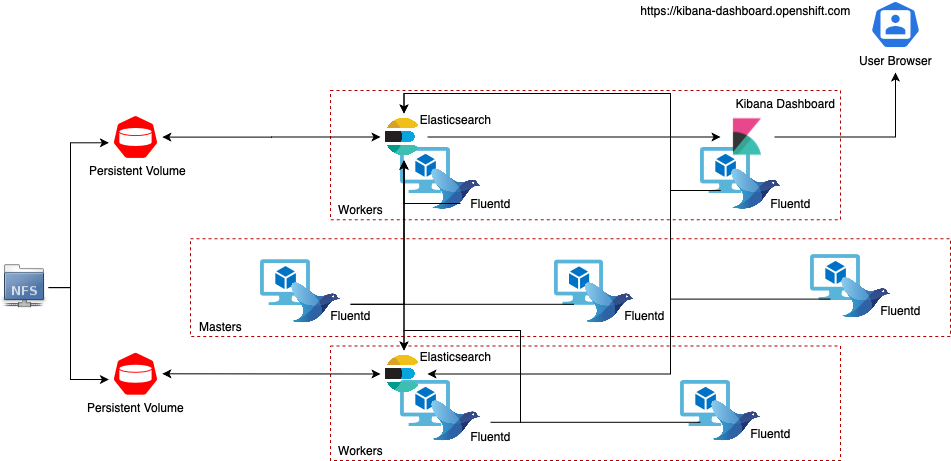

# Ansible Role for Cluster Logging Stack Deployment

## Table of Contents
1. [Role Structure](#paragraph2)
2. [OpenShift Cluster Logging Stack Diagram](#paragraph0)
3. [Cluster Logging Role](#paragraph1)

## Role Structure <a name="paragraph2"></a>

```
├── logging
│   ├── defaults
│   │   └── main.yml
│   ├── files
│   │   └── main.yml
│   ├── images
│   │   └── logging-diagram.png
│   ├── README.md
│   ├── tasks
│   │   └── main.yml
│   ├── templates
│   │   └── clo-logging-instance.yaml.j2
│   └── vars
│       └── main.yml
```

## OpenShift Cluster Logging Stack Diagram <a name="paragraph0"></a>



From the above diagram, the cluster logging components are based upon Elasticsearch, Fluentd, and Kibana (EFK). 

The collector, Fluentd, is deployed to each node in the OpenShift Container Platform cluster. It collects all node and container logs and writes them to Elasticsearch (ES). 

Kibana is the centralized, web UI where users and administrators can create rich visualizations and dashboards with the aggregated data.

There are currently 5 different types of cluster logging components:

* **logStore** - This is where the logs will be stored. The current implementation is Elasticsearch.
* **collection** - This is the component that collects logs from the node, formats them, and stores them in the `logStore`. The current implementation is Fluentd.
* **visualization** - This is the UI component used to view logs, graphs, charts, and so forth. The current implementation is Kibana.
* **curation** - This is the component that trims logs by age. The current implementation is Curator.
* **event routing** - This component forwards OpenShift Container Platform events to cluster logging. The current implementation is Event Router.

For more about Cluster Logging, please refer to [Confluence page](https://tools.cloud.ebms.ericsson.net/confluence/pages/viewpage.action?spaceKey=VIVRH3PP&title=Cluster+Logging)


## Cluster Logging Role <a name="paragraph1"></a>

We are installing cluster logging by deploying the Elasticsearch and Cluster Logging Operators. 

* The Elasticsearch Operator creates and manages the Elasticsearch cluster used by cluster logging. 
* The Cluster Logging Operator creates and manages the components of the logging stack.

Elasticsearch and Cluser Logging Operators are being deployed by creating Subscription object for both:

*Elasticsearch Operator Subscription*:
```yaml
apiVersion: operators.coreos.com/v1alpha1
kind: Subscription
metadata:
  name: elasticsearch-operator
  namespace: openshift-operators
spec:
  channel: '4.4'
  installPlanApproval: Automatic
  name: elasticsearch-operator
  source: redhat-operators
  sourceNamespace: openshift-marketplace
```

*Cluster Logging Operator Subscription*:
```yaml
apiVersion: operators.coreos.com/v1alpha1
kind: Subscription
metadata:
  name: cluster-logging
  namespace: openshift-logging
spec:
  channel: '4.4'
  installPlanApproval: Automatic
  name: cluster-logging
  source: redhat-operators
  sourceNamespace: openshift-marketplace
```

Once both Operators are deployed, we create ClusterLogging instance which will kick off EFK stack components creation:

```yaml
---
apiVersion: "logging.openshift.io/v1"
kind: "ClusterLogging"
metadata:
  name: "instance"                                  #1
  namespace: "openshift-logging"
spec:
  managementState: "Managed"                        #2
  logStore:
    type: "elasticsearch"                           #3
    elasticsearch:
      nodeCount: {{ es_node_count }}                #4
      storage:
        storageClassName: {{ storage_class }}    #5
        size: {{ es_pv_size }}
      redundancyPolicy: "SingleRedundancy"
  visualization:
    type: "kibana"                                  #6
    kibana:
      replicas: 1
  curation:
    type: "curator"                                 #7
    curator:
      schedule: "30 3 * * *"
  collection:
    logs:
      type: "fluentd"                               #8
      fluentd: {}
```

1. The name must be `instance`. <br>
2. The cluster logging management state. In some cases, if you change the cluster logging defaults, you must set this to `Unmanaged`. However, an unmanaged deployment does not receive updates until the cluster logging is placed back into a managed state.<br>
3. Settings for configuring Elasticsearch. Using the Custom Resource (ClusterLogging), you can configure shard replication policy and persistent storage.<br>
4. Specify the number of Elasticsearch nodes. See the note that follows this list.<br>
5. Specify that each Elasticsearch node in the cluster is bound to a Persistent Volume Claim.<br>

:exclamation: Persistent Volumes for each Elasticsearch pod must be created beforehand with sufficiant size.<br>

6. Settings for configuring Kibana. Using the Custom Resource (ClusterLogging), you can scale Kibana for redundancy and configure the CPU and memory for your Kibana nodes.<br>
7. Settings for configuring Curator. Using the Custom Resource (ClusterLogging), you can set the Curator schedule.<br>
8. Settings for configuring Fluentd. Using the Custom Resource (ClusterLogging), you can configure Fluentd CPU and Memory limits.<br>

Lets walk through the Role Tasks. 

Here we are creating the Namespace for Cluster Logging. Cluster Logging must be created in `openshift-logging` Namespace. We are also setting the label `openshift.io/cluster-monitoring: "true"`. This will include logging namespace in Cluster Monitoring list.

```yaml
---
# tasks file for logging

- name: Set Namespace for cluster logging
  k8s:
    state: present
    api_version: v1
    kind: Namespace
    definition:
      metadata:
        name: openshift-logging
        annotations:
          openshift.io/node-selector: ""
        labels:
          openshift.io/cluster-monitoring: "true"
```

Here we are deploying Elasticsearch Operator. We are deploying Elasticsearch Operator to `openshift-operators` Namespace which is already present on the cluser.

```yaml
- name: Deploy elasticsearch operator
  k8s:
    state: present
    api_version: operators.coreos.com/v1alpha1
    kind: Subscription
    name: elasticsearch-operator
    namespace: openshift-operators
    definition:
      spec:
        channel: '4.4'
        installPlanApproval: Automatic
        name: elasticsearch-operator
        source: redhat-operators
        sourceNamespace: openshift-marketplace
```

We are creating OperatorGroup for `openshift-logging` namespace. This object will set required RBAC permissions for Operator to run and  create/access required OpenShift resources.

```yaml
- name: Set Operator Group for cluster logging
  k8s:
    state: present
    api_version: operators.coreos.com/v1
    kind: OperatorGroup
    namespace: openshift-logging
    definition:
      metadata:
        name: openshift-logging
      spec:
        targetNamespaces:
        - openshift-logging
```

Here we are deploying Cluster Logging Operator.

```yaml
- name: Deploy cluster logging operator
  k8s:
    state: present
    api_version: operators.coreos.com/v1alpha1
    kind: Subscription
    name: cluster-logging
    namespace: openshift-logging
    definition:
      spec:
        channel: '4.4'
        installPlanApproval: Automatic
        name: cluster-logging
        source: redhat-operators
        sourceNamespace: openshift-marketplace
```

Here we are generating our ClusterLogging custom resource from the template and deploying it on `openshift-logging` Namespace:

```yaml
- name: Make ClusterLogging instance template
  template:
    src: templates/clo-logging-instance.yaml.j2
    dest: "{{role_path }}/files/cluster-logging-kibana-instance.yaml"

- name: Deploy ClusterLogging
  ignore_errors: true
  k8s:
    state: present
    src: "{{role_path }}/files/cluster-logging-kibana-instance.yaml"
```

:exclamation: Containers do not receive ca-bundle from the hosting machines. 

Since we are using Company signed certificate, we need to manually mount our custom ca-bundle. For that we are first creating empty ConfigMap in `openshift-logging` Namespace with the label `config.openshift.io/inject-trusted-cabundle: 'true'`. 
Certificate Operator will notice new ConfigMap with this label and will populate ca-bundle.crt content into the ConfigMap:

```yaml
- name:  Create empty ConfigMap for intermediateCA
  k8s:
    state: present
    kind: ConfigMap
    namespace: openshift-logging
    name: trusted-ca
    definition:
      metadata:
        labels:
          config.openshift.io/inject-trusted-cabundle: 'true'
```

Once we have ca-bundle.crt as a ConfigMap, we can mount it to the Kibana Deployment. Notice we are mounting ConfigMap to both containers: `kibana` and `kibana-proxy` and the mount point is `/etc/pki/ca-trust/extracted/pem`:

```yaml
- name: Patch Kibana Deployment
  k8s:
    state: present
    kind: Deployment
    merge_type: strategic-merge
    name: kibana
    namespace: openshift-logging
    definition:
      spec:
        template:
          spec:
            containers:
              - name: kibana
                volumeMounts:
                  - name: trusted-ca
                    readOnly: true
                    mountPath: /etc/pki/ca-trust/extracted/pem
              - name: kibana-proxy
                volumeMounts:
                  - name: trusted-ca
                    readOnly: true
                    mountPath: /etc/pki/ca-trust/extracted/pem
            volumes:
              - name: trusted-ca
                configMap:
                  name: trusted-ca
                  items:
                    - key: ca-bundle.crt
                      path: tls-ca-bundle.pem
                  defaultMode: 420      
```

Lets look closer at the configuration. 
We add our ConfigMap to `volumes` list providing the key `ca-bundle.crt` - this is the name of the key given by Certificates Operator. Since ConfigMap represents a file or list of files, the path here is the filename. 

If we look at `/etc/pki/ca-trust/extracted/pem` on any linux machine, we will see `tls-ca-bundle.pem` there. 

Since we want to overwrite it, that is the name we are giving as our ConfigMap path. Content of `tls-ca-bundle.pem` is automatically placed in `/etc/pki/tls/certs/ca-bundle.crt`.

We are mounting our `ca-bundle.crt` to mount point `/etc/pki/ca-trust/extracted/pem` on the both containers. 


```yaml
    volumeMounts:
      - name: trusted-ca
        readOnly: true
        mountPath: /etc/pki/ca-trust/extracted/pem
<...>
volumes:
  - name: trusted-ca
    configMap:
      name: trusted-ca
      items:
        - key: ca-bundle.crt
          path: tls-ca-bundle.pem
      defaultMode: 420      
```

This is the list of Pods created by Cluster Logging Stack. As mentioned previously, Fluentd is a DaemonSet running pod on each VM, we have 2 Elasticsearch pods and 1 Kibana pod:

```bash
$> oc get pods -n openshift-logging

NAME
cluster-logging-operator-cb795f8dc-xkckc

elasticsearch-cdm-b3nqzchd-1-5c6797-67kfz
elasticsearch-cdm-b3nqzchd-2-6657f4-wtprv

fluentd-2c7dg
fluentd-9z7kk
fluentd-br7r2
fluentd-fn2sb
fluentd-pb2f8
fluentd-zqgqx
fluentd-rf4er

kibana-7fb4fd4cc9-bvt4p
```
