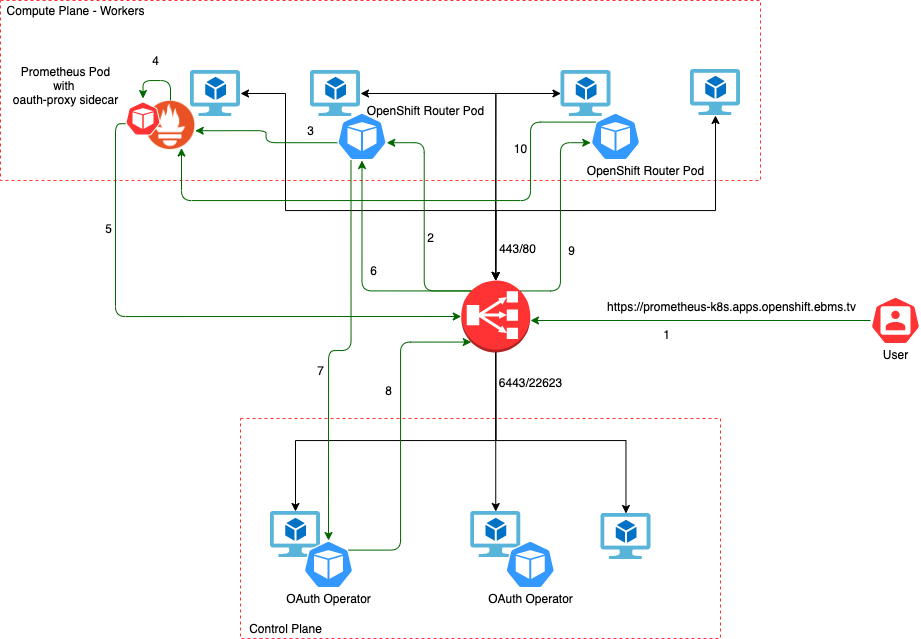
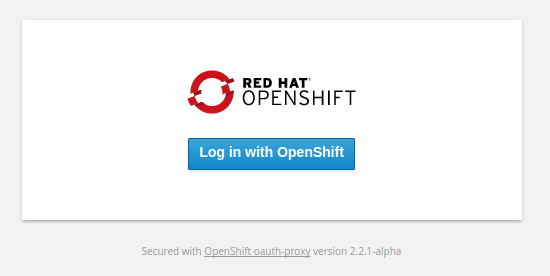

# Ansible Role to Setup Authentication

## Table of Contents
1. [Role Structure](#paragraph3)
2. [OpenShift OAuth Proxy](#paragraph0)
3. [OpenShift OAuth Authentication Diagram](#paragraph1)
4. [OpenShift OAuth Operator](#paragraph2)


## Role Structure <a name="paragraph3"></a>

```
├── oauth
├── files
├── images
│   ├── front.png
│   └── oauth-proxy.png
├── README.md
└── tasks
    └── main.yml
```

## OpenShift OAuth Proxy <a name="paragraph0"></a>

OpenShift OAuth Proxy is a reverse proxy and static file server that provides authentication and authorization to an OpenShift OAuth server or Kubernetes master supporting the 1.6+ remote authorization endpoints to validate access to content.
It is intended for use within OpenShift clusters to make it easy to run both end-user and infrastructure
services that don't provide their own authentication.

### Features 

* Performs zero-configuration OAuth when run as a pod in OpenShift
* Able to perform simple authorization checks against the OpenShift and Kubernetes RBAC policy engine to grant access
* May also be configured to check bearer tokens or Kubernetes client certificates and verify access
* On OpenShift 3.6+ clusters, supports zero-configuration end-to-end TLS via the out of the box router

It is a fork of the https://github.com/bitly/oauth2_proxy project with other providers removed. It's
focused on providing the simplest possible secure proxy on OpenShift.

### Using this Proxy with OpenShift 

This proxy is best used as a sidecar container in a Kubernetes pod, protecting another server that listens only on localhost. On an OpenShift cluster, it can use the service account token as an OAuth client secret to identify the current user and perform access control checks.

For more info about oauth-proxy, please refer to [OpenShift oauth-proxy](https://github.com/openshift/oauth-proxy)

## Openshift OAuth Authentication Diagram <a name="paragraph1"></a>



Above example shows the flow when accessing Prometheus UI for the first time.

1. User sends the request to Prometheus URL
2. Load Balancer forwards the request to one of the OpenShift Router pods
3. OpenShift Router Pod find the Prometheus Pod and forwards the request there
4. Since Prometheus has oauth-proxy running as a sidecar container, request lands on the sidecar first.



5. If user is not authenticated, oauth-proxy forwards the User via Load Balancer to authenticate with OpenShift OAuth (in our case HTPASSWD)
6. Load Balancer forwards the request to OpenShift Router Pod
7. OpenShift Router Pod forwards the requst to OAuth pod which is running on one of the masters
8. Once authenticated, by using predefined redirect URL OAuth Pod sends the request back via Load Balancer to Prometheus Pod
9. Load Balancer forwards the request to OperShift Router Pod
10. OpenShift Router Pod forwards the request to Prometheus Pod with authenticated user.

## OpenShift OAuth Operator <a name="paragraph2"></a>

The authentication operator is an [OpenShift ClusterOperator](https://github.com/openshift/enhancements/blob/master/enhancements/operator-dev-doc.md#what-is-an-openshift-clusteroperator).  

It installs and maintains the Authentication [Custom Resource](https://kubernetes.io/docs/concepts/extend-kubernetes/api-extension/custom-resources/) in a cluster and can be viewed with:     

```yaml
oc get clusteroperator authentication -o yaml
```
Identity provider for this PoC is the HTPasswd IdP.

## Building the HTPASSWD file

Using the `htpasswd` module, we can create a `htpasswd` file with the users specified in the `groups_and_users` dictionary in `group_vars/all`. In the dictionary below, we are only using the `username` from each group.

```yaml
groups_and_users: 
  cluster_admin: 
    group_name: 'OpenShift Admins'
    username: cluster_admin_user
  cluster_reader: 
    group_name: 'OpenShift ReadOnly'
    username: cluster_reader_user
  developer:
      group_name: 'OpenShift Developer'
      username: developer_user
  tester:
    group_name: 'OpenShift Tester'
    username: tester_user
```
For this example, we are using a password of `redhat1` for each username and saving the htpasswd file to `/files/htpassword`.

```yaml
- name: Authentication via HTPasswd
  block:
    - name: Build HTPASSWD file
      htpasswd:
        state: present
        path: "{{ role_path }}/files/htpassword"
        name: "{{ item.value.username }}"
        password: "redhat1"
      with_dict: "{{ groups_and_users }}"
```

Next we are creating a Secret Object containing our `htpassword` file. The secret is holding base64 encoded data, so we are encoding our `htpassword` file content.

```yaml
- name: Create htpassword secret
  k8s:
    state: present
    api_version: v1
    kind: Secret
    namespace: openshift-config
    name: htpasswd
    definition:
      type: Opaque
      data:
        htpasswd: "{{ lookup('file', role_path + '/files/htpassword') | b64encode }}"
```

Next we are configuring the OAuth server to use the HTPasswd IdP from the secret by editing the spec of the cluster-wide `OAuth/cluster` object:

```yaml
- name: Create htpassword oauth config
  k8s:
    state: present
    api_version: config.openshift.io/v1
    kind: OAuth
    name: cluster
    definition:
      spec:
        identityProviders:
          - htpasswd:
              fileData:
                name: htpasswd
            mappingMethod: claim
            name: htpasswd
            type: HTPasswd
```

The operator will now restart the OAuth server deployment and mount the new config. When the operator is available again (`oc get clusteroperator authentication`), you should be able to log in:

```yaml
oc login -u cluster_admin_user -p redhat1
```

Currently, each user can log into the cluster, but they'll have no permissions and won't be able to interact with anything. This is due to the absence of RBAC (Role Based Access Control) roles being applied to each user.

## RBAC overview

Role-based access control (RBAC) objects determine whether a user is allowed to perform a given action within a project.

Cluster administrators can use the cluster roles and bindings to control who has various access levels to the OpenShift Container Platform platform itself and all projects.

Developers can use local roles and bindings to control who has access to their projects. 

## Applying RBAC 

To demonstrate RBAC we're going to apply 4 out-the-box Cluster Roles to groups that each user is a member of. Applying Cluster Roles to groups makes managing user permissions easier as we wouldn't have to configure granular access control for each user. Below is a table describing each user, the group they're a member of, the roles that'll be applied and an example of a user that'll use the specific Cluster Role. The description column provides an explanation of the Cluster Role being used.

User Type | Username | Group Name | Cluster Role | Description
--- | --- | --- | --- | ---
Cluster Admin | cluster_admin_user | OpenShift Admins | cluster_admin | A super-user that can perform any action in any project. When bound to a user with a local binding, they have full control over quota and every action on every resource in the project.
Cluster Reader | cluster_reader_user | OpenShift ReadOnly | cluster-reader | A user who can read, but not view, objects in the cluster.
Developer | developer_user | OpenShift Developer | admin | If used in a local binding, an admin user will have rights to view any resource in the project and modify any resource in the project except for quota.
Tester | tester_user | OpenShift Tester | view | A user who cannot make any modifications, but can see most objects in a project. They cannot view or modify roles or bindings.


### Creating Namespaces

In this project we are binding the Cluster Roles to the deafult `openshift-config` namespace. However, when binding local Roles we bind them to the project we wish to give Groups or Users permissions for. In this playbook we create 3 test projects named `developer-project-(1-3)` which we'll bind our Roles to.

```yaml
# Create developer namespaces 

- name: Create namespaces
  k8s:
    state: present
    kind: namespace
    name: '{{ item }}'
    merge_type: 
      - strategic-merge
      - merge     
  loop: '{{ project_names }}'          #1
```
1. Loops through the `project_names` list from `group_vars/all` and creates the projects

### Creating Groups

As we are binding our Roles to groups, we'll first need to create the groups. We create the `groups` specified in the `groups_and_users` dictionary.

```yaml
# Create groups
- name: Create cluster_admin_group user Group
  k8s:
    state: present
    api_version: user.openshift.io/v1
    kind: Group
    name: '{{ item.value.group_name }}'
    merge_type: 
      - strategic-merge
      - merge     
  with_dict: '{{ groups_and_users }}'             #1
```
1. Loops through the `groups_and_users` dictionary and creates the group based off `group_name`.

### Binding Cluster Roles to Groups

Below we'll bind our 4 Cluster Roles into the groups specified:

* Binding the `cluster_admin` Cluster Role to the `OpenShift Admins` group.

```yaml 
- name: Bind cluster-admin role to the Openshift Admins group
  k8s:
    state: present
    api_version: rbac.authorization.k8s.io/v1
    kind: ClusterRoleBinding                                    #1
    name: cluster-admin-cluster-admin-crb
    namespace: openshift-config                                 #2
    merge_type: 
      - strategic-merge
      - merge     
    definition:
      metadata:
        annotations:
          rbac.authorization.kubernetes.io/autoupdate: "true"   #3
      roleRef:
        apiGroup: rbac.authorization.k8s.io
        kind: ClusterRole
        name: cluster-admin                                     #4
      subjects:
      - apiGroup: rbac.authorization.k8s.io
        kind: Group
        name: '{{ groups_and_users.cluster_admin.group_name }}' #5
```

1. We use a ClusterRoleBinding because cluster-admin is cluster scope.
2. Deploy the ClusterRoleBinding to the `openshift-config` namespace.
3. Set autoupdate to `true` to ensure roles are reconciliated during a master restart.
4. Specify the ClusterRole `cluster-admin`.
5. Specify the `'Openshift Admins'` group name.

```yaml
- name: Bind cluster-reader role to the Cluster Reader
  k8s:
    state: present
    api_version: rbac.authorization.k8s.io/v1
    kind: ClusterRoleBinding                                     #1
    name: cluster-admin-cluster-reader-crb
    namespace: openshift-config                                  #2
    merge_type: 
      - strategic-merge
      - merge     
    definition:
      metadata:
        annotations:
          rbac.authorization.kubernetes.io/autoupdate: "true"    #3
      roleRef:
        apiGroup: rbac.authorization.k8s.io
        kind: ClusterRole
        name: cluster-reader                                     #4
      subjects:
      - apiGroup: rbac.authorization.k8s.io
        kind: Group
        name: '{{ groups_and_users.cluster_reader.group_name }}' #5
```

1. We use a ClusterRoleBinding because cluster-reader is cluster scope.
2. Deploy the ClusterRoleBinding to the `openshift-config` namespace.
3. Set autoupdate to `true` to ensure roles are reconciliated during a master restart.
4. Specify the ClusterRole `cluster-reader` .
5. Specify the `'OpenShift ReadOnly'` group name.

```yaml
- name: Bind admin role to the Developer group
  k8s:
    state: present
    api_version: rbac.authorization.k8s.io/v1
    kind: RoleBinding                                           #1
    name: developer-group-rb
    namespace: '{{ item }}'                                     #2
    merge_type: 
      - strategic-merge
      - merge     
    definition:
      metadata:
        annotations:
          rbac.authorization.kubernetes.io/autoupdate: "true"   #3
      roleRef:
        apiGroup: rbac.authorization.k8s.io
        kind: ClusterRole                                       
        name: admin                                             #4
      subjects:
      - apiGroup: rbac.authorization.k8s.io
        kind: Group
        name: '{{ groups_and_users.developer.group_name }}'     #5
  loop: '{{ project_names }}'                                 
```
1. We use a RoleBinding as a developer user only needs a local namespace scope.
2. Apply the Role Binding to each `developer-project-(1-3)` namespace
3. Set autoupdate to `true` to ensure roles are reconciliated during a master restart.
4. Specify the ClusterRole `admin`. Although we're binding it to a local Role, the out-the-box Roles that come with Openshift are ClusterRoles.  
5. Specify the `'OpenShift Developer'` group name.

```yaml
- name: Bind view role to the Tester group
  k8s:
    state: present
    api_version: rbac.authorization.k8s.io/v1
    kind: RoleBinding                                           #1
    name: tester-group-rb
    namespace: '{{ item }}'                                     #2
    merge_type: 
      - strategic-merge
      - merge     
    definition:
      metadata:
        annotations:
          rbac.authorization.kubernetes.io/autoupdate: "true"   #3
      roleRef:
        apiGroup: rbac.authorization.k8s.io
        kind: ClusterRole
        name: view                                              #4
      subjects:
      - apiGroup: rbac.authorization.k8s.io
        kind: Group
        name: '{{ groups_and_users.tester.group_name }}'        #5
  loop: '{{ project_names }}'
```

1. We use a RoleBinding as a developer user only needs a local project scope.
2. Apply the Role Binding to each `developer-project-(1-3)` project.
3. Set autoupdate to `true` to ensure roles are reconciliated during a master restart.
4. Specify the ClusterRole `view`. Although we're binding it to a local Role, the out-the-box Roles that come with Openshift are ClusterRoles.  
5. Specify the `'OpenShift Tester'` group name.

## Binding our Users to Groups

Once each group has the correct permissions, we'll need to populate the groups. In this example we'll assign our users specified in the `groups_and_users` dictionary to their corresponding groups. However, once more users are made they can be added to any group and inherit that groups permissions. For example I can add the user `bob` to `'Openshift Admins'` and now `bob` will be a cluster admin.

```yaml
- name: Bind Users to Groups
  k8s:
    state: present
    api_version: user.openshift.io/v1
    name: "{{ item.value.group_name }}"      #1
    kind: Group
    merge_type: 
      - strategic-merge
      - merge     
    definition:
      users:
      - "{{ item.value.username }}"          #2
  with_dict: '{{ groups_and_users }}'        #3
```
1. Specifiy the group name.
2. Specify the User to add to the group.
3. Loop over the `'groups_and_users'` dictionary.

Finally, we'll clean up the role by removing the `htpasswd` file with our users and credentials. We can remove this as it's already been consumed and applied by Openshift.

```yaml
- name: Remove file from tmp directory
  file:
    path: "{{ role_path }}/files/htpassword"
    state: absent
```
